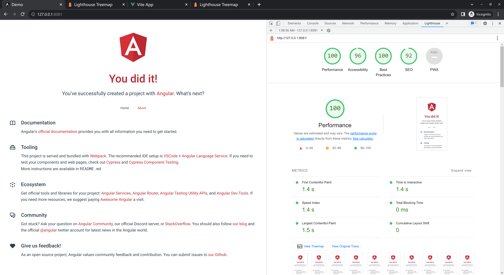
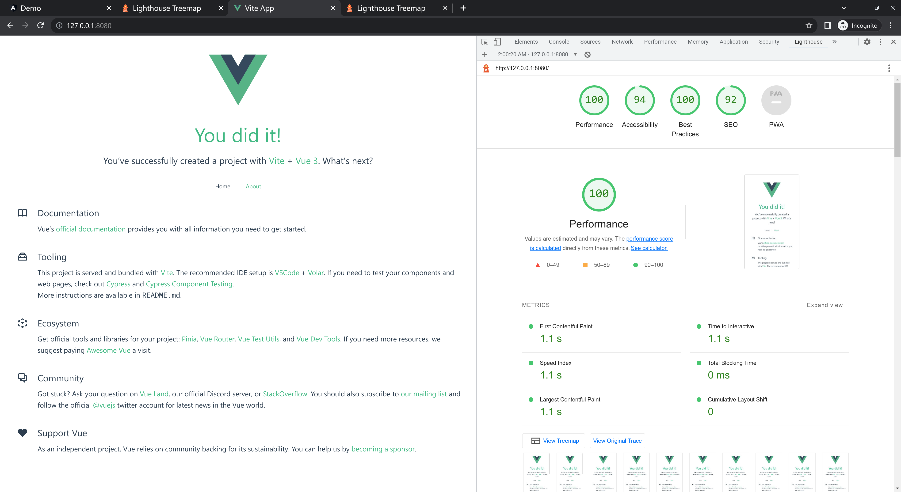
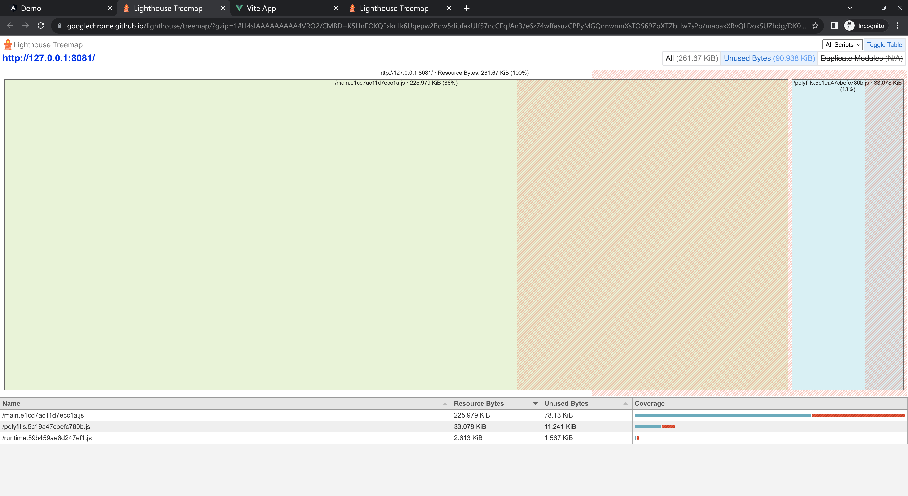
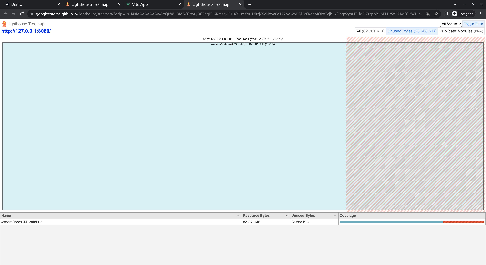

# Angular Starter Demo (comparing Vue 3 w/ Vite)

This project was generated with [Angular CLI](https://github.com/angular/angular-cli) version 15.2.0. Install dependencies by `pnpm i`.

The project is a dumb one-to-one copy of the Vue 3 starter project created by `npm init vue@latest`, with a slight tweak of CSS styling and the text. For fun and for curiosity.

## Build

If you have `brotli` installed on your system, you can run `npm run build:brotli` to build and compress your build artifacts in one go, after which you can run `npm run serve:prod` to serve it locally.

The reference Vue 3 + Vite project can be found [here](https://github.com/HymanZHAN/vue3-starter-demo).

## Comparison

### Lighthouse

_More details can be found in the [lighthouse](./lighthouse/) folder_

### Treemap

_Unused amount of JavaScript_

